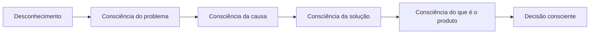

# Plano: Código como App/Serviço + Conscientização até a Compra

## Objetivo

Reposicionar o **Código da Deusa** como **solução tipo app/serviço** (não curso) e desenhar a jornada para **educar e conscientizar o lead** até o momento da compra, para que ele compre com clareza, não por impulso.

---

## 1. Reposicionamento: De Curso para Solução/App/Serviço

### O que evitar
- Palavras: "curso", "aula", "módulo" (no sentido de aula), "estudar", "conteúdo", "assistir".
- Tom de "produto digital estático" ou "pacote de vídeos".

### O que usar
- **Solução / sistema / método ativo**: "solução de 21 dias", "sistema que ativa", "método que aplica", "ritual que implanta".
- **Serviço / acesso**: "acesso ao Código", "sua jornada no app", "ferramenta disponível para você", "seu espaço de transformação".
- **App / plataforma**: "dentro do Código você", "no seu painel", "sua rotina diária no Código", "acesse de qualquer lugar".
- **Resultado contínuo**: "uso diário", "prática guiada", "acompanhamento", "sua evolução", "seu progresso salvo".

### Copy de referência (substituições)
| Evitar | Usar |
|--------|------|
| "Curso de 21 dias" | "Solução de 21 dias" / "Sua jornada de 21 dias no Código" |
| "7 módulos" | "7 ativações" / "7 passos do sistema" / "7 ferramentas do Código" |
| "Assista as aulas" | "Siga sua rotina diária" / "Ative cada passo" |
| "Conteúdo exclusivo" | "Acesso ao sistema" / "Sua solução disponível" |
| "Compre o curso" | "Ative seu acesso" / "Comece sua jornada" / "Garanta sua solução" |

---

## 2. Funil de Conscientização (Educar até a Compra)

O lead deve **entender o problema**, **reconhecer a solução** e **saber o que está comprando** antes de clicar no CTA final.

### Etapas da consciência

### Por tela

| Tela | Objetivo de consciência | O que o lead deve sair sabendo |
|------|-------------------------|--------------------------------|
| **Welcome** | Que existe um "diagnóstico" e que ele pode descobrir algo sobre si. | "Posso descobrir o que me bloqueia." |
| **Pre-questionnaire** | Que nome, sonhos e data importam para a solução. | "Isso é personalizado para mim." |
| **Questionário (5 perguntas)** | Que o bloqueio tem padrão e causa. | "Meu problema tem nome e causa." |
| **Diagnóstico (Results)** | Qual é o padrão dele e o que está "desligado". | "Agora sei meu bloqueio e meu % de poder." |
| **Oferta** | Que existe um método/sistema que ataca essa causa. | "Existe uma solução para o meu padrão." |
| **Prova (depoimentos, antes/depois)** | Que outras pessoas usaram e mudaram. | "Isso funciona para pessoas como eu." |
| **O que é o produto** | Que não é curso, é solução/acesso/sistema de uso. | "É um sistema que uso no dia a dia, não uma aula." |
| **Preço e garantia** | Quanto custa, o que recebe, risco zero. | "Vale o investimento e posso testar sem risco." |
| **Decisão** | Contraste claro: continuar como está vs ativar a solução. | "Se eu não agir, nada muda; se agir, tenho o Código." |
| **CTA final** | Que o próximo passo é ativar o acesso. | "Agora eu ativo meu acesso." |

### Regra de copy
- Cada seção **ensina um pouco**: uma ideia nova por bloco.
- Antes de cada CTA importante, **reforçar em uma linha** o que ela está fazendo (ex.: "Ativando seu acesso ao Código de 21 dias").
- FAQ e garantia devem **esclarecer dúvidas de serviço**: "É um app?", "Como uso?", "Quando começo?", "E se não for para mim?".

---

## 3. Onde Ajustar na Página (Checklist)

### Welcome
- [ ] Remover qualquer menção a "curso".
- [ ] CTA: "Descobrir meu diagnóstico" / "Ver minha análise" (foco em solução, não em "comprar curso").

### Pre-questionnaire
- [ ] Labels que reforcem "sua solução personalizada" (nome, sonhos, data).
- [ ] Após enviar: "Preparando sua análise" / "Configurando seu diagnóstico" (tom de serviço).

### Questionário
- [ ] Feedbacks que levem à causa ("O problema não é você, é o padrão").
- [ ] Nenhuma menção a "curso"; falar em "método" ou "sistema".

### Results – Diagnóstico
- [ ] Manter foco em padrão e %; sem "curso".
- [ ] CTA: "Ver a solução" / "Conhecer o sistema".

### Results – Oferta
- [ ] "Sistema" / "solução" / "método de 21 dias".
- [ ] "7 ativações" ou "7 passos do Código" em vez de "7 módulos" (se fizer sentido no design).

### Results – Módulos/Conteúdo
- [ ] Cards como "Passo 1", "Ativação 1" ou "Ferramenta 1" com descrição de **uso** ("Você usa isso para…"), não "aula sobre…".
- [ ] Valor: "Sistema completo" / "Acesso ao Código", não "curso com X aulas".

### Results – Depoimentos
- [ ] Depoimentos que falem de "usei o Código", "entrei no sistema", "minha rotina no Código", não "fiz o curso".

### Results – Preço
- [ ] "Investimento no acesso" / "Ativar seu Código" / "Garantir sua solução".
- [ ] Badge: "Acesso imediato" + "7 dias para testar" (serviço, não "garantia de curso").

### Results – Garantia
- [ ] "Teste o Código por 7 dias. Se não for para você, cancelamos seu acesso." (linguagem de serviço/assinatura quando aplicável).

### Results – FAQ
- [ ] Pergunta: "É um curso?" → Resposta: "Não. É uma solução de 21 dias que você usa no dia a dia. Acesso a um sistema de ativações e rotina guiada."
- [ ] Incluir: "Como uso?" / "Quando começo?" / "É tipo um app?" (educar sobre o produto).

### Results – Decisão e CTA final
- [ ] "Continuar sem o Código" vs "Ativar minha solução".
- [ ] Botão: "Ativar meu acesso" / "Quero minha solução" / "Começar minha jornada no Código".

---

## 4. Gamificação ao Extremo (Alinhada ao Público)

- **Progresso visível**: barra de jornada (Parte 1–5), % de "poder", XP, níveis.
- **Recompensas por etapa**: badge/conquista a cada conclusão (nome, sonhos, cada pergunta, revelar preço, desbloquear oferta).
- **Feedback imediato**: animação/som/mensagem a cada clique importante.
- **Sensação de avanço**: "Você está aqui", "Faltam 2 passos para sua oferta", "Nível 3 desbloqueado".
- **Tom simples e direto**: frases curtas, um conceito por bloco, sem jargão.
- **CTAs óbvios**: um botão principal por tela, grande e legível (min 48px), texto de ação claro.

---

## 5. UI/UX – Regras para Evitar Erros

- **Contraste**: texto legível em fundo escuro (ex.: purple-200/300 em fundos escuros; verificar AA).
- **Toque**: todos os alvos clicáveis ≥ 48px de altura.
- **Hierarquia**: um H1 por página; H2 por seção; CTAs em destaque (cor/sombra).
- **Mobile**: botões full-width onde fizer sentido; texto sem quebra estranha (`break-words` em títulos).
- **Loading/estados**: botões com estado de loading; mensagem após envio de formulário.
- **Navegação**: usuário sempre sabe o próximo passo; evitar dead-ends.
- **Consistência**: mesmos termos em toda a página ("Código", "acesso", "solução", "sistema").

---

## 6. Ordem de Implementação Sugerida

1. **Copy global** – Trocar "curso" / "módulos" / "aula" por "solução" / "sistema" / "acesso" / "ativação" em todos os textos.
2. **FAQ** – Incluir pergunta "É um curso?" e resposta posicionando como app/serviço; adicionar "Como uso?" e "Quando começo?".
3. **Oferta e preço** – Reescrever oferta e card de preço com linguagem de serviço e CTA "Ativar acesso".
4. **Decisão e CTA final** – Textos "Continuar sem o Código" vs "Ativar minha solução"; botão final "Ativar meu acesso".
5. **Blocos de consciência** – Em cada seção, garantir uma linha que "eduque" antes do CTA (o que ela está fazendo / o que é o produto).
6. **Gamificação** – Revisar badges, XP e mensagens para reforçar "progresso na jornada" e "ativação".
7. **Revisão UI/UX** – Checklist de contraste, toque, hierarquia e estados.

---

## 7. Métricas de Sucesso (Sugestão)

- Taxa de conclusão do questionário (consciência do problema).
- Scroll até a seção "O que é o produto" / FAQ (consciência do que está comprando).
- Taxa de clique no CTA final (decisão consciente).
- Redução de bounce na página de checkout (lead que chega sabendo o que é).

---

*Documento de planejamento. Não substitui o plano de alta conversão ou o blueprint; complementa com foco em posicionamento app/serviço e conscientização.*
